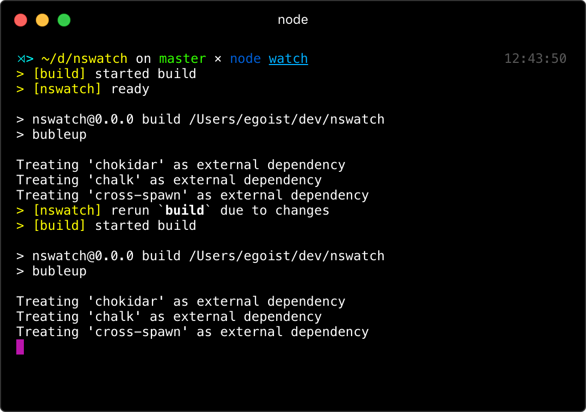

# nswatch

[](https://npmjs.com/package/nswatch) [](https://npmjs.com/package/nswatch) [](https://circleci.com/gh/egoist/nswatch)

> Like gulp.watch but for npm scripts.

## Install

```bash
$ npm install -D nswatch
```

## Usage

Assuming you have an npm script `build` to compile something, then drop a `watch.js` in your project:

```js
const watch = require('nswatch')

watch('src/*.js', ['build'])
```

When you run `node watch`, the `npm run build` will be invoked right away, and will also be invoked when file changes are detected.



### Parallel and Sequence

`Array` will be treated as parallel, `String` will be treated as sequence:

```js
// run in parallel
watch('src/a.js', ['task-a', 'task-b'])
// run in sequence
// use ! as seperator
watch('src/b.js', 'task-a!task-b')
```

## CLI

```bash
$ npm install -g nswatch
```

You can also use `nswatch` as a command-line program:

### Configure `watch` in `package.json`

```json
{
  "watch": {
    "./src/*.js": ["build"],
    "./src/*.css": "compile!minify"
  }
}
```

Then run:

```bash
$ nswatch
```

Or you can pass the config via CLI arguments, this way configurations in `package.json` will be ignored.

```bash
# in parallel
$ nswatch "src/*.js" --script foo --script bar

# in sequence
$ nswatch "src/*.js" --script "foo!bar"
```

## Author

**nswatch** © [EGOIST](https://github.com/egoist), Released under the [MIT](https://egoist.mit-license.org/) License.<br>
Authored and maintained by EGOIST with help from contributors ([list](https://github.com/egoist/nswatch/contributors)).

> [egoistian.com](https://egoistian.com) · GitHub [@egoist](https://github.com/egoist) · Twitter [@rem_rin_rin](https://twitter.com/rem_rin_rin)
